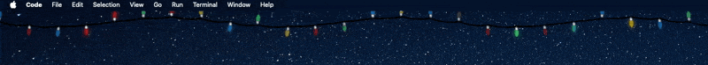

       
       <h1>Fairy Lights</h1>
   

Fairy Lights is exactly what it sounds like: fairy lights that float beneath your macOS menu bar. A simple, decorative addition for your desktop, perfect for the holiday season.

Designed and developed in Swift.

> [!NOTE]
> All assets were hand-drawn and are not included in this project

## Features

- Lives in the macOS menu bar
- Subtle, twinkling fairy lights that replicate real decorative lights

## Install

- Download the `FairyLights.zip` file from the [latest release](https://github.com/chippokiddo/FairyLights/releases/latest)
- Unzip the file and move `Fairy Lights.app` into your `Applications` folder
- Control-click or right-click the app and select 'open'

> [!NOTE]
> Since Fairy Lights is not notarized, macOS Gatekeeper may block the app:
>
> - Go to System Settings > Privacy & Security
> - Scroll down and locate the prompt for `Fairy Lights.app`
> - Click 'open anyway'

## Contribute

Contributions are welcome! Follow these steps to contribute:

1.  Fork the repository
2.  Create a branch with your feature or bug fix
3.  Submit a pull request for review
